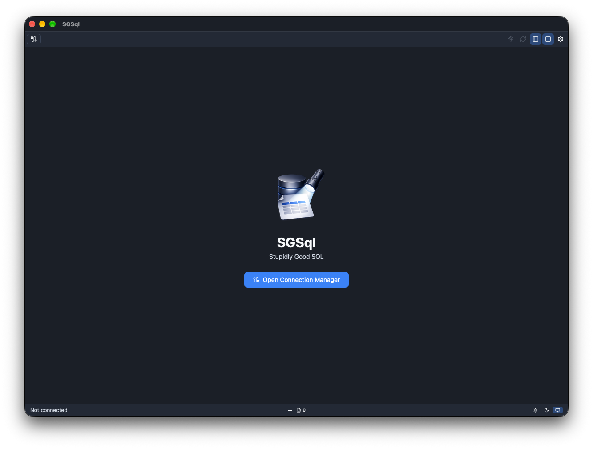
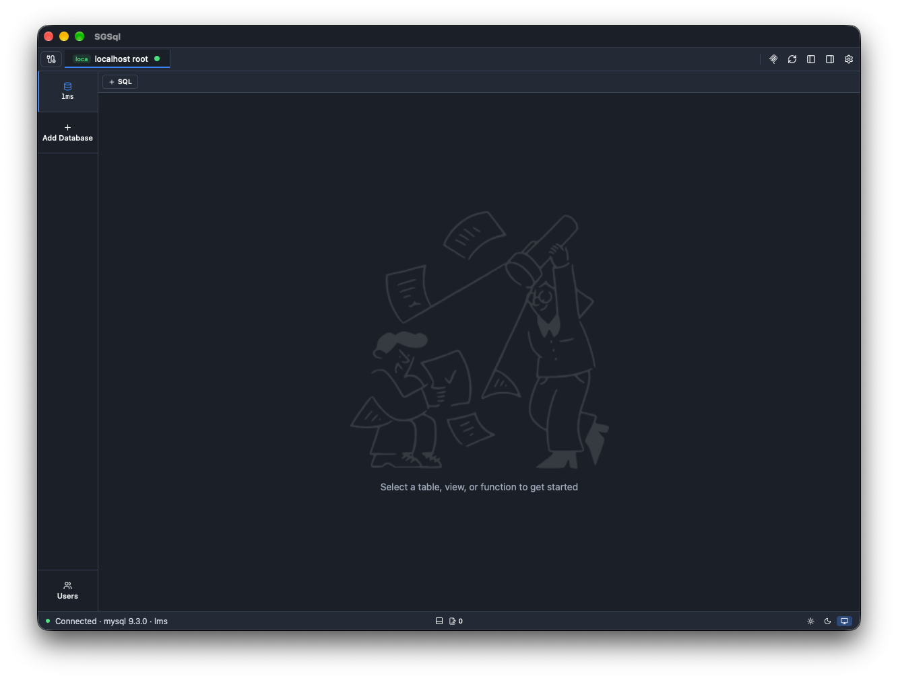
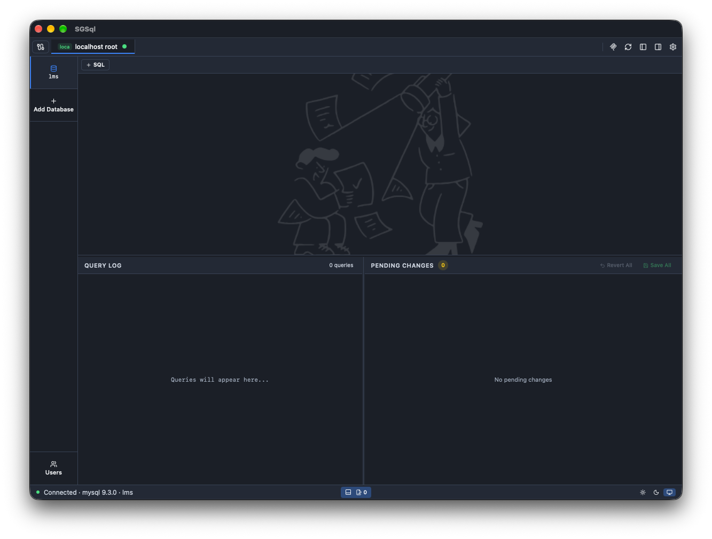
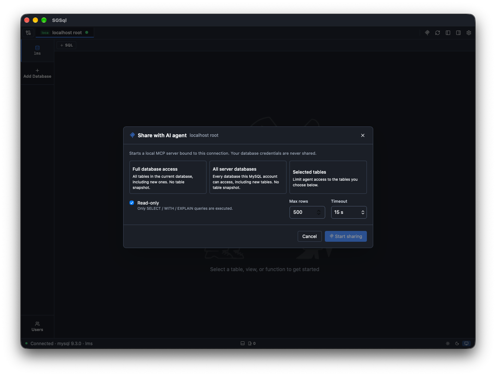
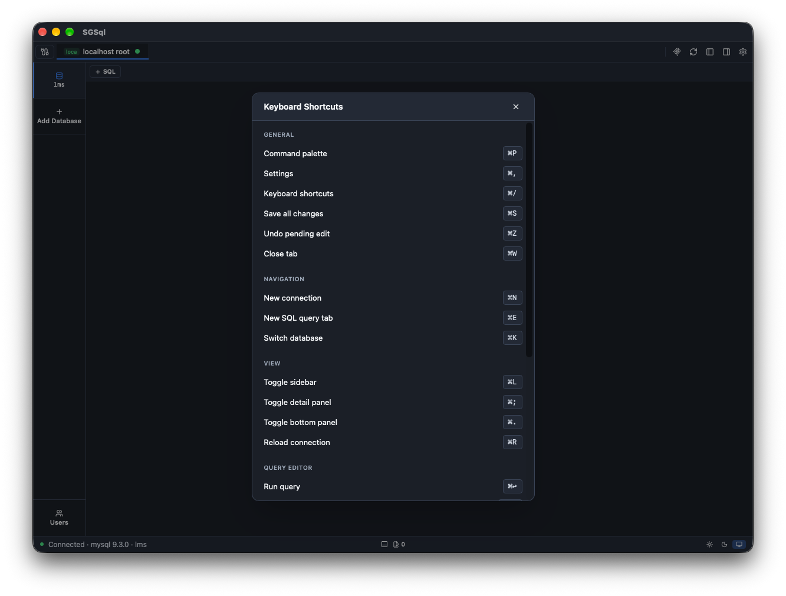

# SGSql

**Stupidly Good SQL** — a fast desktop SQL client for MySQL, PostgreSQL and
SQLite, with a built-in way to share a connection with AI agents over MCP.



Most SQL clients are either slow and bloated or missing the one thing you
need. SGSql opens fast, runs your query and gets out of the way.

## Features

- **MySQL, PostgreSQL and SQLite**, including connections over SSH tunnels
- **Monaco editor** (the editor behind VS Code) with schema-aware autocomplete
- **Fast data grid** with inline row editing, filters, sorting and a
  pending-changes panel to review, save or revert edits
- **Keyboard-first**: command palette (⌘P), switch database (⌘K), new query
  tab (⌘E), fuzzy search across tables, views and functions
- **Import and export**: export several tables at once; SQL import runs in a
  single transaction
- **Query history and log**, with query output remembered per connection
- **Share with AI agents**: expose an open connection to Claude Code, Cursor,
  Codex and other agents as a local MCP server

### Share a connection with AI, safely

Instead of pasting schemas into a chat or handing an agent your real
credentials, click the MCP icon and share the connection:

- Choose the scope: selected tables, the whole database, or (MySQL) every
  database the account can reach
- **Read-only by default**; read-write is opt-in
- The agent never sees your credentials. Every statement is parsed and
  checked first, and DDL and side-effect functions like `pg_sleep` are blocked
- Row caps and per-statement timeouts
- The agent's queries appear in your query log, so you can see exactly what it ran
- Shares end when the tab closes, with a fresh token every time

Then ask things like *"why is this report query slow?"* or *"find orders with
no matching invoice"* and the agent works against the real schema. See
[Share a connection with an AI agent](#share-a-connection-with-an-ai-agent)
for the full details.

## Download

Get the latest `.dmg` from
[Releases](https://github.com/stalingino/sgsql/releases/latest). The app
updates itself after that.

- macOS on Apple Silicon only, for now
- Builds are not notarized yet, so the first launch needs a right-click →
  **Open** (or approval in System Settings → Privacy & Security)

## Screenshots

| Connected to a database | Query log and pending changes |
|---|---|
|  |  |

| Share with an AI agent | Keyboard shortcuts |
|---|---|
|  |  |

## Build the macOS app

SGSql is bundled as a macOS application using Tauri. The database sidecar is a Rust binary (`src-tauri/sidecar`, built on axum + sqlx) compiled with Cargo and included in the application bundle.

### Prerequisites

Install the Xcode command-line tools:

```bash
xcode-select --install
```

Install Rust, then add the Apple Silicon macOS target:

```bash
rustup target add aarch64-apple-darwin
```

Install the project dependencies:

```bash
bun install
```

Create a stable local code-signing identity (one-time, see [Code signing](#code-signing) below):

```bash
./scripts/setup-codesign-identity.sh
```

## Run in development

Compile and sign the database sidecar before the first development run, or whenever its source changes:

```bash
bun run sidecar:build
```

Start the Tauri development application:

```bash
bun run tauri dev
```

Tauri starts the Vite development server automatically and launches the desktop application. Frontend changes are applied through Vite hot reload; Rust changes cause the Tauri application to rebuild.

To run the sidecar directly while developing it, use two terminals:

First generate a temporary development token, then export the same value in
both terminals:

```bash
openssl rand -hex 32
export SGSQL_SIDECAR_TOKEN="<generated value>"
```

```bash
# Terminal 1
bun run sidecar:dev
```

```bash
# Terminal 2
bun run tauri dev
```

The development application reuses the sidecar on port `45821` only after an
authenticated health check with that token. Otherwise, it starts a managed
sidecar on an available loopback port with its own token. Packaged applications
also use a separate available port, so a leftover development sidecar cannot
intercept their requests. Stop both development processes when finished.

### Create the application bundle

Compile the database sidecar first, then build the Tauri application:

```bash
bun run sidecar:build
bun run tauri build
```

The generated bundles are written to:

```text
src-tauri/target/aarch64-apple-darwin/release/bundle/macos/SGSql.app
src-tauri/target/aarch64-apple-darwin/release/bundle/dmg/SGSql_2.1.1_aarch64.dmg
```

Verify the completed application bundle before sharing it:

```bash
codesign --verify --deep --strict --verbose=2 \
  src-tauri/target/aarch64-apple-darwin/release/bundle/macos/SGSql.app
```

### Architecture support

The current sidecar build produces `dbsidecar-aarch64-apple-darwin`, so the packaged application supports Apple Silicon Macs only. Intel or universal macOS builds require additional sidecar binaries for their respective targets.

### Code signing

The app and sidecar are signed with a **stable, self-signed** code-signing
identity (`SGSql Developer`) rather than ad-hoc (`-`) signing.

Ad-hoc signatures are a hash of the binary itself, so they change on every
build. macOS Keychain access-control lists are bound to the app's signature,
so an ad-hoc-signed app looks like a *different, untrusted app* after every
rebuild — this is why Keychain used to prompt for the store password on every
new release. A self-signed identity keeps the same signature across builds
(same certificate, same key), so the Keychain entry keeps matching and the
app is not re-prompted.

Run this once per machine to generate and install the identity:

```bash
./scripts/setup-codesign-identity.sh
```

This does **not** make Gatekeeper trust the app on other people's Macs —
self-signed certificates aren't in Apple's trust chain. Downloaded builds
still show an "unidentified developer" warning on first launch. Avoiding that
warning requires a paid Apple Developer ID Application certificate and
notarization; swap `signingIdentity` in `src-tauri/tauri.conf.json` for your
Developer ID identity and add a notarization step if/when you enroll.

### Distribution

Self-signed builds can be used for development and trusted internal testing.
A downloaded build still requires the user to approve it once in macOS
Privacy & Security (right-click → Open). To distribute the application
without that manual approval, code-sign and notarize it with an Apple
Developer ID certificate instead of the self-signed one described above.

## Share a connection with an AI agent

Any open connection can be shared with an AI coding agent (Claude Code,
Cursor, Codex, …) as a local [MCP](https://modelcontextprotocol.io) server.
Click the MCP icon in the top-right toolbar, choose **Selected tables** or
**Full database access** (the current database). MySQL connections also offer
**All server databases** for every database the account can access. Choose
**Read-only** (default) or read-write, and start sharing. Neither full-database
nor all-server access enumerates tables when the share starts; both cover tables
added later.


The dialog shows a ready-to-paste config, for example:

```bash
claude mcp add --transport http sgsql-my-db http://127.0.0.1:45822/mcp/<share id> \
  --header "Authorization: Bearer <token>"
```

The agent gets `list_tables` (names only, with an optional `pattern` filter),
`describe_table`, `get_table_ddl` and `query`; read-write shares also get
`transaction`, which runs up to 100 statements all-or-nothing, and all-server
MySQL shares also get `list_databases`. Writes return `affectedRows` plus
`lastInsertId` (MySQL/SQLite) or `RETURNING` rows (Postgres/SQLite), and
`query` accepts `maxValueLength` to cut long text values short. On MySQL,
`SHOW COLUMNS`, `SHOW CREATE TABLE` and `DESCRIBE` work for accessible tables. It never sees your database
credentials: the sidecar executes statements on its own dedicated connection
and enforces the rules before anything reaches the database.

- Every statement is parsed; only selected tables, tables in the current
  database (full access), or databases accessible to the MySQL account
  (all-server access) may be referenced, one statement per call. Other MySQL
  databases use qualified names such as `analytics.events`.
  DDL / `SET` / `COPY` / transaction control and
  side-effect functions (`pg_sleep`, `pg_terminate_backend`, `sleep`, …) are
  rejected. Read-only shares also run in a database-level read-only session.
- Results are capped (500 rows by default) and each statement has a timeout
  (15 s by default); both limits are stated in the tool descriptions.
  The 500-table limit applies only to selected-table shares; full database
  and all-server shares have no table-count limit. `list_databases` discovers
  database names and `list_tables` discovers tables in one database on demand.
- Shares are session-only: they stop when the tab is closed or SGSql quits,
  and a new token is generated every time.
- Agent statements show up in the query console like your own.
- The MCP listener binds `127.0.0.1:45822` (falls back to a free port if it is
  taken) and refuses browser origins; each share has its own bearer token.

Known limitations: a shared *view* may read tables that are not shared, and
SQL the parser does not understand is rejected rather than executed.

## Releases and auto-update

Tagged pushes (`vX.Y.Z`) trigger [`.github/workflows/release.yml`](.github/workflows/release.yml),
which builds the sidecar and the signed `.app`/`.dmg`, then publishes them as
a draft GitHub Release along with `latest.json` — the manifest the in-app
updater polls. No separate update server or website is needed; the updater's
endpoint in `src-tauri/tauri.conf.json` points straight at
`https://github.com/stalingino/sgsql/releases/latest/download/latest.json`.

To cut a release:

1. Bump `version` in `package.json`, `src-tauri/tauri.conf.json`, and both
   Rust manifests; update `src-tauri/Cargo.lock`.
2. Commit, then tag and push: `git tag vX.Y.Z && git push origin vX.Y.Z`.
3. Wait for the workflow to finish, review the draft release, publish it.

Update artifacts are signed with a separate Tauri updater keypair (unrelated
to the macOS code-signing identity above) so the app can verify downloaded
updates weren't tampered with. The public key is already embedded in
`tauri.conf.json`. The private key lives at `~/.tauri/sgsql-updater.key`
(generated locally, **not committed**) — for CI to sign releases, add these
repository secrets under Settings → Secrets and variables → Actions:

| Secret | Value |
| --- | --- |
| `TAURI_SIGNING_PRIVATE_KEY` | contents of `~/.tauri/sgsql-updater.key` |
| `TAURI_SIGNING_PRIVATE_KEY_PASSWORD` | contents of `~/.tauri/sgsql-updater.key.password` |
| `APPLE_CODESIGN_P12_BASE64` | `base64 -i sgsql-codesign.p12` (export via `security export`, see `setup-codesign-identity.sh` output) |
| `APPLE_CODESIGN_P12_PASSWORD` | the password used when exporting the `.p12` |

Back up `~/.tauri/sgsql-updater.key` and its password somewhere safe outside
the repo — losing it means future releases can no longer be verified by
apps that already trust the current public key, breaking auto-update for
existing users.

In the app, users can check for updates manually from Settings → Updates, or
you can wire `checkForUpdate()` from `src/lib/updater.ts` into a startup
check.

## License

Free for personal and other non-commercial use under the
[PolyForm Noncommercial License 1.0.0](LICENSE).
